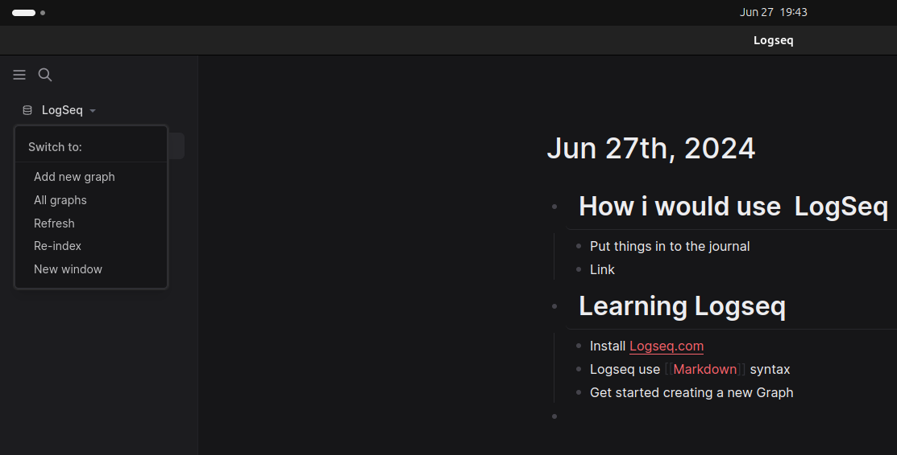

# How i would use  LogSeq
	- Put things in to the journal
	- Link
- # [[Learning Logseq]]
	- Install [Logseq.com](https://logseq.com/)
	- Logseq use [[Markdown]] syntax
	- Get started creating a new Graph
	  collapsed:: true
		- 
	- Start writing in the Journals
	- Link using square brackets [[]]
		- Whenever you link to a page in Logseq, you actually create *two* links; one that you write, and one that automatically appears in the ***Linked references*** section of the page you link to.
		- If you didn't link to a page but did use its name in the text, you can see all mentions in the ***Unlinked references*** section
	- It's not just linking to pages that creates bidirectional links; linking to an individual block will also create a link in two directions. See [[Linking Blocks]]
	-
	-
	-
	-