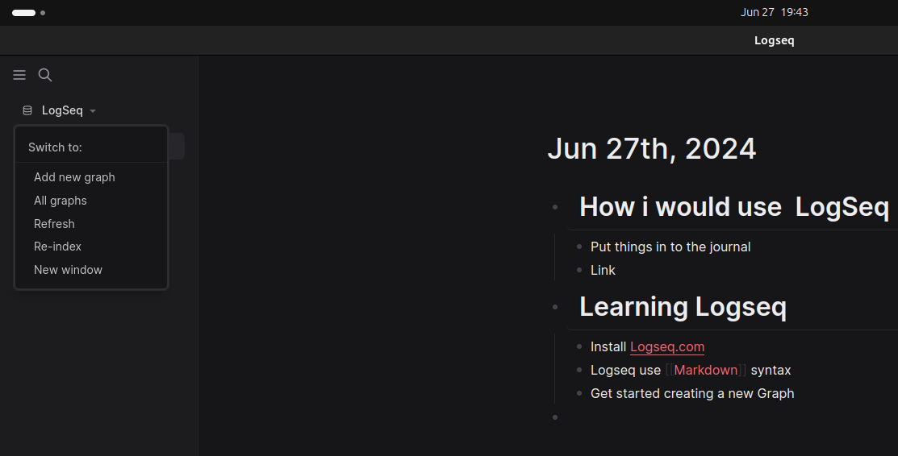

- Install [Logseq.com](https://logseq.com/)
- Logseq use [[Markdown]] syntax
- Get started creating a new Graph
  collapsed:: true
	- 
- Start writing in the Journals
- Link using square brackets [[]]
  id:: a1cd77f0-8953-4798-a0bf-dc5daef4847e
	- Whenever you link to a page in Logseq, you actually create *two* links; one that you write, and one that automatically appears in the ***Linked references*** section of the page you link to.
	- If you didn't link to a page but did use its name in the text, you can see all mentions in the ***Unlinked references*** section
- It's not just linking to pages that creates bidirectional links; linking to an individual block will also create a link in two directions. See [[Linking Blocks]]
- Aliases and external links
  id:: 0a7dcbd5-071a-4700-aec1-2329c1b35fc0
	- To point to a URL
		- use the trigger menu typing "/link"
		- use the shortcut ctrl-l to add the \ markdown
			- between the square brackets put label of the link
			- Between the parenthesis, put the URL
			- example: [This is the label or name of the link](https://thisistheurl.com), click it to see the the formatting
		- Link to other pages using [[aliases]]
			- use the alias function to link to an internal page (the \ markdown to add aliase)
			- example: `[I worked on projects]([[Projects]])` will make the entire "I worked on projects" sentence clickable and point it to the *Projects* page.
		- Add [[aliases]] to a page  to identify them
			- For example, you might want the link `[[PKM]]` to point to the page `Personal Knowledge Management`. To do this, add the following in the **first block** of the page `Personal Knowledge Management`: `alias:: PKM`
				- Now, anytime you click a `[[PKM]]` link, you'll end up on the `Personal Knowledge Management` page.
- Indentation
	- Indenting a block *nests* it under the block above, creating a parent-child relationship:
		- [[Parent A]]
			- [[Child B]]
			- [[Parent and Child C]]
				- [[Child D]]
- filter linked references
	- By clicking a filter value, you include it, meaning that only the block with the value you selected will *show* on the page. When you `Shift-Click` a filter value, you *exclude* it from the page, meaning that any block that contains that value is *hidden*.
	- Logseq will remember what filters you've set
- Block references [[Linking Blocks]]
	- We can link to blocks using block reference
	- every block in Logseq has an address
		- we can reference a block by using `((double parenthesis))` and placing its address in between.
	- There are four ways to reference blocks:
	  id:: 24a59c74-26d8-49ed-89a1-346927a56542
		- Copying their address
		  id:: 7c5d4c2b-7963-4a29-8f28-bf3366678d77
			- `Right-Click` on the bullet of the block you want to reference, and click `Copy block ref` to copy its address (including double parentheses) to your clipboard
			  id:: f1985bc5-cc67-4840-a0dc-c3d88a770757
			- ((667eb3cc-47b4-4b99-8a02-cc5eb8dd4b2d))
			  id:: 05dbbf3f-1dec-4b7c-9134-bb48a9160251
		- Click-dragging them
		  id:: a0015d6c-9c7a-46d7-93ec-79c1479604ee
			- drag and drop holding the alt key
		- Searching for them
		  id:: b1806b3a-b89b-4bac-80e0-a8a5f0d9a57b
			- User ctrl-k shortcut to open the search bar and search for a block
			- use \(( and type what you are seaching
		- In an alias
		  id:: d31b7837-26e4-4b60-a08c-23f7aa126ed7
			- \[link text](((block-address)))
			  id:: d76f9a6a-73f4-49e8-85fa-32235341ef4b
				- Between the single `[brackets]` you place the label text for the link. Between the `(single parentheses)`, you put the block address (including `((double parentheses))`)
				- [this is a block reference using markdown alias link](((667eb828-3aa1-4d36-bad1-28b6eeb214cb)))
	- block embeds and block references
	  id:: 8a6873b9-22f3-45f6-aca6-1cf21f34c9a5
		- Block Embeds allow you to edit the source directly, which comes in handy when building dashboards and pulling different parts of your graph together.
		- Embeds always show the complete context; the child blocks of the embedded block, and all of *their* child blocks:
		- to embed a block type \/block embed is will add the markdown  \{{embed (())}}
		-
	- Page embeds
	  id:: 667ebe70-c90f-4563-afa7-8fa21d7c4e68
		- To do so, use the `/page embed` trigger to call the page embed shortcode \{{embed [[]]}}
		-
		-
		-
		-
		-
		-
		-
		-
		-
	-
	-
	-